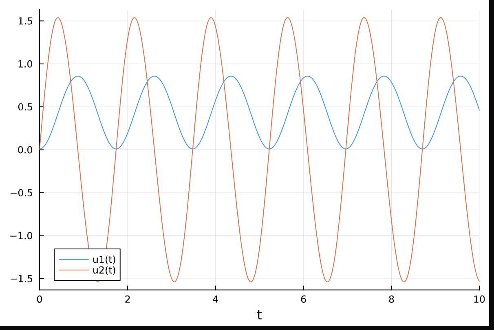
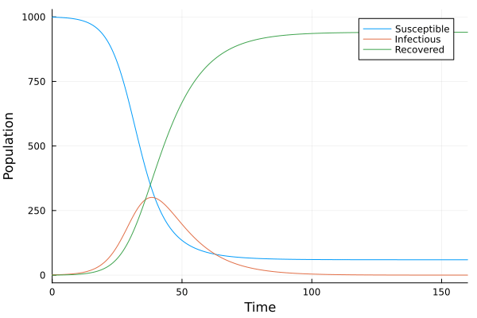
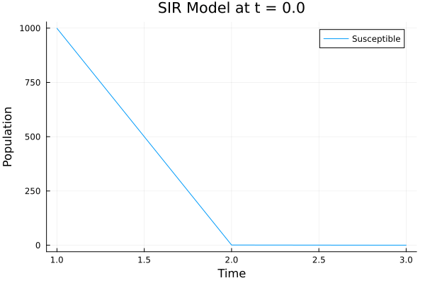
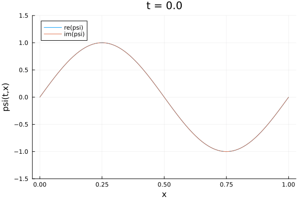

# Scientific Machine learning Using Julia

## Ordinary Differential Equations

### Oscilation of a pendulum

**Equations**:

dθ(t)/dt = ω(t)

dω(t)/dt = -3g/2l sin(θ(t)) + 3/ml^2M(t)

**Output**:

### SIR Model

For predicting suspetible, recovered and infected population in a pandemic

**Equations**

dS(t)/dt = −βS(t)I(t)/N

dI(t)/dt = βS(t)I(t)/N − γI(t)

dR(t)/dt = γI(t),

**Output**:

, 

###

For predicting suspetible, recovered and infected population in a pandemic

**Equations**

dS(t)/dt = −βS(t)I(t)/N

dI(t)/dt = βS(t)I(t)/N − γI(t)

dR(t)/dt = γI(t),

**Output**:

, 

## Partial Differential Equations

### Schrodinger Equation

**Equation**

i∂ψ(t, x)/∂t =∂^2ψ(t, x)/∂x^2 + V (x)ψ(t, x)

**Output**:

,
