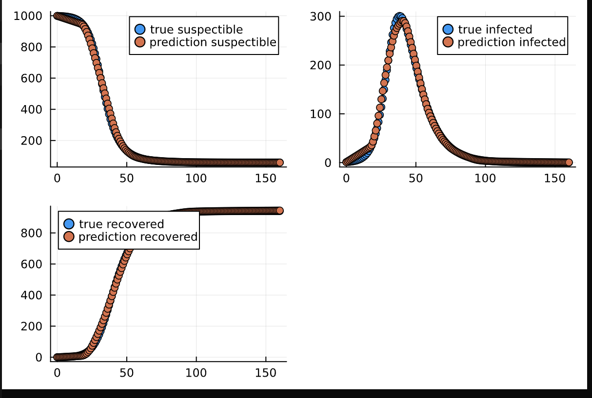
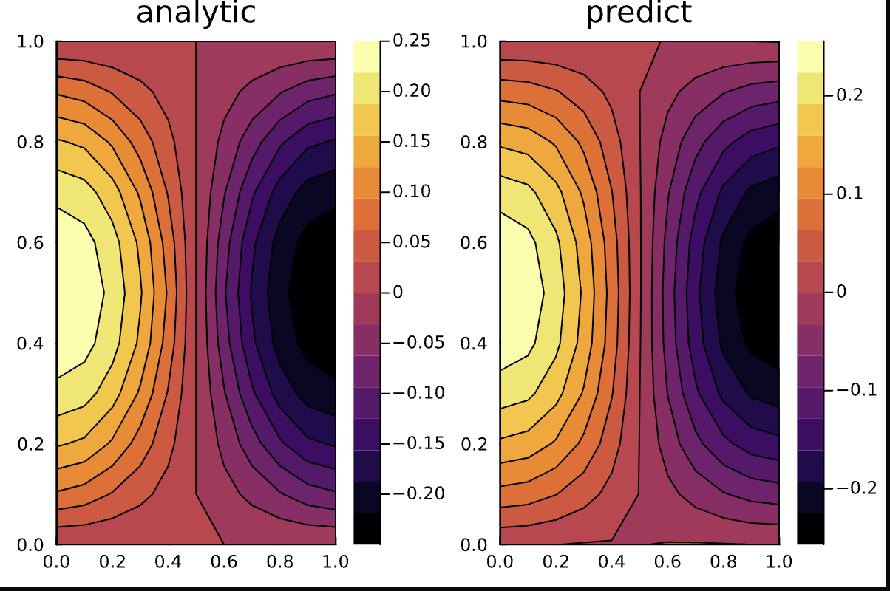
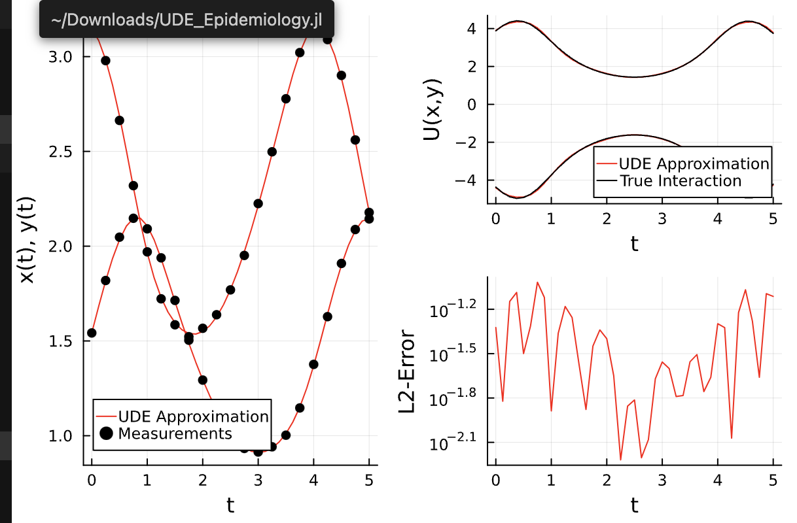

# Scientific Machine learning Using Julia

## Ordinary Differential Equations

### Oscilation of a pendulum

**Equations**:

```
dθ(t)/dt = ω(t)

dω(t)/dt = -3g/2l sin(θ(t)) + 3/ml^2M(t)
```

**Output**:


### SIR Model

For predicting suspetible, recovered and infected population in a pandemic

**Equations**

```
dS(t)/dt = −βS(t)I(t)/N

dI(t)/dt = βS(t)I(t)/N − γI(t)

dR(t)/dt = γI(t),
```

**Output**:

, 

###

For predicting suspetible, recovered and infected population in a pandemic

## Partial Differential Equations

### Schrodinger Equation

**Equation**

```
i∂ψ(t, x)/∂t =∂^2ψ(t, x)/∂x^2 + V (x)ψ(t, x)
```

**Output**:

,

## Neural ODEs

### SIR Model

Solving the SIR model using a Neural Ordinary differential equation to predict infected, susceptible and recoevered population in a sample size of 1000

**Equations**

```
dS(t)/dt = −βS(t)I(t)/N

dI(t)/dt = βS(t)I(t)/N − γI(t)

dR(t)/dt = γI(t),
```

,

## Neural PDE

### 1 Dimensional Wave equation

**Equations**

```
∂^2u(x, t)/∂t^2 = c^2 ∂^2u(x, t)/∂x^2

u(0, t) = u(1, t) = 0 for all t > 0

(2) u(x, 0) = x(1 − x) for all 0 < x < 1

(3) ∂u(x, 0) ∂t = 0 for all 0 < x < 1
```

,

## Universal Differential Equations

### Lotka Voltera Predator Prey model

**Equations**

```
dx/dt = αx − βxy,
dy/dt = −δy + γxy

```

,
